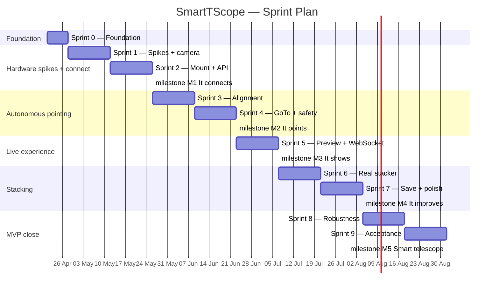

# SmartTScope — Agile Plan (Coaching Review + Updated)

**Author**: External Agile Coach
**Date**: 2026-04-21
**Supersedes**: `docs/milestone-plan.md` v1.0 (retained for reference)

---

## Coaching assessment of milestone-plan v1.0

The original plan shows genuine product thinking — customer-moment framing, honest quality gates, and a clear MVP boundary. Those are real strengths. The structural problem is that it is a **waterfall plan with agile vocabulary**. The word "sprint" appears for M0, "milestone" otherwise, but the underlying structure is 10 sequential phases with no cadence, no empiricism, and no feedback loops shorter than a month.

Specific problems:

| Problem | Evidence | Consequence |
|---|---|---|
| Sequential milestone chain with no inner rhythm | M0 → M1 → M2 … all strictly sequential | One late milestone cascades into all downstream ones |
| First customer-visible value is week 11 | M3 (live image) is 11 weeks in | Sponsor sees nothing real for nearly three months |
| No sprint cadence, ceremonies, or velocity | Deliverable lists, no story points or iteration | No early warning when scope is too large |
| Risks sit in a register rather than being spiked | "ToupTek SDK availability" is listed as a risk | Risk is never reduced until M1 is attempted |
| Retrospectives 3 times in 8 months | "End of M3, M5, M9" | Process problems persist for months before being addressed |
| Tasks, not user stories | "Implement `OnStepMount` adapter" | Nothing connects the work to user value |
| Python toolchain is bare | Only pytest in dev dependencies | No linting, no type checking, no coverage gate — quality degrades silently |
| Async model is deferred | "Define async model" is M1.2 | The wrong threading decision touches every adapter; deferring it makes it expensive |

**What to keep**: customer-moment milestone names, quality gates, acceptance criteria structure, sponsor demo scripts, and the hardware-first principle from M1 onward. These are sound.

---

## Revised structure

### Two layers, not one

The plan needs two distinct layers that were collapsed into one:

```
Milestones (external, customer-facing, ~6–8 weeks apart)
    └── Sprints (internal, 2-week heartbeat, always deliver working code)
            └── Stories (unit of work, completable in ≤ 3 days)
```

Milestones are commitments to the sponsor. Sprints are how the team works. Stories are how work is sized. These must not be conflated.

### Sprint as the unit of delivery

Every sprint ends with:
- Working, tested, deployed code (even if on mock hardware)
- A sprint review demo (15 min, team + owner)
- A retrospective (30 min, team only)
- Updated backlog

No sprint ends with "work in progress." Incomplete stories roll back to the backlog — they are not carried forward.

### Spikes replace the risk register

Every item in the original risk register is an **unknown**, not a risk. Unknowns are resolved by time-boxed spikes (research tasks), not by hedging language. A spike has a fixed timebox (1–3 days), a clear question, and a concrete output: a proof of concept, a decision, or a documented dead end.

---

## Python toolchain — what is missing

The current `pyproject.toml` has one dev dependency: `pytest`. A production Python project in 2026 needs this full toolchain, all configured before sprint 1 begins.

### Required additions to `pyproject.toml`

```toml
[project]
name = "smart-telescope"
version = "0.1.0"
requires-python = ">=3.11"
dependencies = [
    "fastapi>=0.111",
    "uvicorn[standard]>=0.29",
    "astropy>=6.0",
    "numpy>=1.26",
    "pillow>=10.0",          # JPEG encoding
]

[project.optional-dependencies]
dev = [
    "pytest>=8.0",
    "pytest-asyncio>=0.23",  # async FastAPI endpoint tests
    "pytest-cov>=5.0",       # coverage reporting
    "ruff>=0.4",             # linting + formatting (replaces flake8 + isort + black)
    "mypy>=1.10",            # static type checking
    "pyserial>=3.5",         # OnStep serial adapter
]

[tool.ruff]
line-length = 100
target-version = "py311"

[tool.ruff.lint]
select = ["E", "F", "I", "UP", "B", "SIM", "ANN"]
ignore = ["ANN101", "ANN102"]

[tool.mypy]
python_version = "3.11"
strict = true
ignore_missing_imports = true   # for hardware SDKs without stubs

[tool.pytest.ini_options]
testpaths = ["tests"]
asyncio_mode = "auto"           # pytest-asyncio: no @pytest.mark.asyncio needed
addopts = "--cov=smart_telescope --cov-report=term-missing --cov-fail-under=80"
```

### Why these choices

**ruff** replaces flake8 + isort + black in a single tool. It runs in milliseconds on the full codebase. There is no reason to use the older stack.

**mypy strict** catches the `bytes`-typed port contracts before they reach real hardware. With `FitsFrame` typed correctly (see below), mypy will enforce the contract at every call site.

**pytest-asyncio with `asyncio_mode = "auto"`** means async test functions work without decoration. Every FastAPI endpoint test and every async adapter method can be tested without boilerplate.

**`--cov-fail-under=80`** makes coverage a hard CI gate, not a report. The test suite will fail if coverage drops below 80%.

### The correct `FitsFrame` type

The current `Frame.data: bytes` anti-pattern collapses three distinct things into one opaque blob. The correct replacement uses types that already exist in the dependency graph:

```python
# smart_telescope/domain/frame.py
from dataclasses import dataclass
import numpy as np
from astropy.io.fits import Header

@dataclass(frozen=True)
class FitsFrame:
    pixels: np.ndarray        # shape (height, width), dtype float32
    header: Header            # parsed FITS header — exptime, gain, temp available
    exposure_seconds: float   # convenience accessor, not a second source of truth

    @property
    def width(self) -> int:
        return int(self.pixels.shape[1])

    @property
    def height(self) -> int:
        return int(self.pixels.shape[0])

    @classmethod
    def from_fits_bytes(cls, data: bytes) -> "FitsFrame":
        import io
        from astropy.io import fits
        with fits.open(io.BytesIO(data)) as hdul:
            header = hdul[0].header
            pixels = hdul[0].data.astype(np.float32)
        return cls(
            pixels=pixels,
            header=header,
            exposure_seconds=float(header.get("EXPTIME", 0.0)),
        )
```

`frozen=True` prevents accidental mutation. `np.ndarray` is what every downstream consumer (stacker, stretcher, solver) actually needs. `Header` gives the stacker access to temperature for dark-frame matching and gives the solver the pixel scale from the FITS WCS if present.

### The correct async model

The pipeline has two categories of blocking work that need different treatment:

```python
# CPU-bound: ASTAP subprocess — use ProcessPoolExecutor
# (avoids GIL; ASTAP is a separate process anyway)
async def solve_async(self, frame: FitsFrame, scale: float) -> SolveResult:
    loop = asyncio.get_running_loop()
    with ProcessPoolExecutor(max_workers=1) as pool:
        return await loop.run_in_executor(pool, self._solve_sync, frame, scale)

# I/O-bound: serial, USB camera — use asyncio.to_thread
# (releases GIL; SDK calls block on I/O, not computation)
async def capture_async(self, exposure_s: float) -> FitsFrame:
    return await asyncio.to_thread(self._sdk_capture_sync, exposure_s)

# WebSocket push: runs in the event loop directly — no executor needed
async def push_frame(self, ws: WebSocket, frame: FitsFrame) -> None:
    jpeg = self._stretch_and_encode(frame)  # fast numpy op, acceptable in loop
    await ws.send_bytes(jpeg)
```

**Why not `asyncio.to_thread` for ASTAP?** `to_thread` releases the GIL but the thread still shares the process heap. ASTAP's catalog loads hundreds of MB; in a `ProcessPoolExecutor` this memory is isolated and released when the executor shuts down. On a 4 GB Pi 5, this is the difference between stable and OOM.

---

## Sprint 0 — Foundation (1 week: 2026-04-21 → 2026-04-28)

**Sprint goal**: The team can develop and test with confidence. CI enforces quality. Every known hole in the foundation is closed.

This is not a feature sprint. It is a prerequisite sprint. It runs once and is never repeated. If it takes longer than a week, scope it down — do not extend the timebox.

### Sprint 0 backlog

| ID | Story / Task | Points | AC |
|---|---|---|---|
| S0-1 | Upgrade dev environment to Python 3.11; fix pyproject.toml | 1 | `python --version` → 3.11 in CI |
| S0-2 | Add ruff, mypy, pytest-asyncio, pytest-cov to dev deps | 1 | `ruff check .` and `mypy smart_telescope/` pass with zero errors |
| S0-3 | Add GitHub Actions CI: lint → typecheck → test on push | 2 | Green badge on first commit |
| S0-4 | Add structured logging (stdlib `logging`) to all stage transitions | 1 | Every state transition emits a named log line at INFO level |
| S0-5 | Add `FocuserPort` ABC; add `MockFocuser`; wire into runner | 2 | Runner connects focuser; test covers focuser connect failure |
| S0-6 | Add `stop()` to `MountPort`; add `asyncio.Event` cancellation to runner | 2 | Test: cancellation event set during slew wait raises WorkflowError |
| S0-7 | Introduce `FitsFrame` domain type; migrate all ports | 3 | mypy passes; ReplayCamera returns correct width/height from header |
| S0-8 | Fix test coverage gaps (slew timeout, unpark failure, recenter failure, stacker failure, offset unit) | 2 | Coverage ≥ 80% on CI |
| S0-9 | Move mock tests to `tests/unit/`; rename integration tests correctly | 1 | Directory structure matches test type |

**Total**: 15 points (indicative). If 15 points is too much for one developer in one week, drop S0-7 to sprint 1 and do it before the first hardware work.

### Sprint 0 Definition of Done

- [ ] CI green on Python 3.11: lint + typecheck + test + coverage gate
- [ ] Zero mypy errors in `smart_telescope/`
- [ ] `FocuserPort` in ports/, mocked, wired into runner
- [ ] `MountPort.stop()` exists and is tested
- [ ] Coverage ≥ 80%

---

## Spikes — run before the sprint that needs the answer

The original risk register listed 6 risks. Each one is an unknown that should be converted into a 1–3 day spike with a concrete output. Spikes are not estimable; they are timeboxed. A spike that exceeds its timebox stops and reports what was learned.

| Spike | Timebox | Question | Output | Run in |
|---|---|---|---|---|
| SP-1 | 2 days | Does ToupTek SDK have ARM64/Pi OS Python bindings? | Yes/No + working `capture()` call, or INDI fallback chosen | Sprint 1, days 1–2 |
| SP-2 | 1 day | Does ASTAP install on Pi OS and solve a FITS in < 60 s with G17? | Measured solve time + confirmed catalog path | Sprint 1, days 3 |
| SP-3 | 1 day | Does `astroalign` work reliably on C8 native-FOV star fields (few stars, small FOV)? | Pass/fail + fallback plan (WCS shift) | Sprint 3, days 1 |
| SP-4 | 1 day | What is Pi 5 peak RAM during concurrent ASTAP + numpy stack? | Measured peak; go/no-go on 4 GB model | Sprint 4, days 1 |
| SP-5 | 2 days | What is the correct LX200 serial command set for OnStep V4 (connect, unpark, goto, stop)? | Verified command table + serial session log | Sprint 2, days 1–2 |
| SP-6 | 1 day | What is Pi 5 CPU temp during 90-min stacking? Does it throttle? | Temperature log; heatsink/fan decision | Sprint 5, day 1 |

**SP-1 is the highest-risk spike.** If ToupTek has no ARM64 Python bindings, the entire camera adapter strategy changes. Run it on day 1 of sprint 1, before any adapter code is written.

---

## Epic and story structure

Milestones map to **epics**. Epics are split into **user stories** before a sprint begins. This is backlog refinement — it happens in the last two days of each sprint for the next sprint's work.

### Example: Epic M1 "It connects" broken into stories

```
Epic: As a user, I can power on the system and see that all devices are ready
within 30 seconds, so that I know I can start an observation.

  Story 1.1: As a user, I can open the app and tap Connect,
             so that the system attempts to connect to camera, mount, and focuser.
             AC: POST /session/connect returns {camera, mount, focuser} status within 5 s

  Story 1.2: As a user, I see a named error message for whichever device failed,
             so that I know exactly what to fix without guessing.
             AC: Each device failure returns device_name + suggested_action in JSON

  Story 1.3: As a user, I can tap Retry on a failed device
             without restarting the whole app.
             AC: Retry re-attempts only the failed device; successful devices stay connected

  Story 1.4: As a developer, the system validates ASTAP + catalog at startup
             so that a missing solver surfaces before a session is attempted.
             AC: Service refuses to start session if ASTAP or G17 not found; error is named

  Story 1.5: As a developer, hardware adapters use FitsFrame
             so that the frame format contract is enforced by types, not convention.
             AC: mypy passes; ToupTekCamera.capture() returns FitsFrame
```

Each story is completable in 1–3 days by one developer. Stories that are bigger than that are split again before the sprint starts. A sprint contains 4–8 stories depending on complexity.

---

## Revised sprint plan

Two-week sprints. Milestone markers show when the customer-visible experience is shippable. The first customer-visible value moves from week 11 to **week 7**.



| Sprint | Goal | Key deliverable | Milestone |
|---|---|---|---|
| S0 (1w) | Solid foundation | CI green, FitsFrame, FocuserPort, stop() | — |
| S1 (2w) | Spikes resolved; camera captures | SP-1 + SP-2 done; ToupTekCamera.capture() on Pi | — |
| S2 (2w) | Mount moves; API exists | OnStepMount.goto(); POST /session/connect live | **M1** |
| S3 (2w) | Telescope plate-solves and syncs | Full align stage on real sky; ASTAP on Pi | — |
| S4 (2w) | Telescope centers a target | GoTo + recenter on M42; emergency stop; solar gate | **M2** |
| S5 (2w) | Live image on phone | WebSocket JPEG push; auto-stretch; Wi-Fi pair | **M3** |
| S6 (2w) | Stack improves live | Real numpy stacker; astroalign registration | — |
| S7 (2w) | Session saves correctly | PNG + JSON log; storage estimate; file naming | **M4** |
| S8 (2w) | Robust unattended operation | Periodic recenter; tracking loss; health dashboard | — |
| S9 (2w) | MVP acceptance | 3 unattended sessions pass; thermal test; sponsor sign-off | **M5** |

**MVP target: 2026-08-18** (one week earlier than the original plan, because the spike strategy removes the hidden float built into the risk register).

---

## Sprint ceremonies

These are not optional ceremonies bolted onto the process. They are the process. A sprint without a review is a sprint with no feedback. A sprint without a retrospective is a sprint that repeats its mistakes.

### Sprint planning (2 h, start of each sprint)

1. Review sprint goal (5 min) — one sentence, agreed by all
2. Pull stories from the top of the backlog until the sprint is full
3. Each story is confirmed to have clear AC before it is accepted
4. Identify spikes needed this sprint (timeboxed, not estimated)
5. Identify any stories that need hardware access — block time for it

**Capacity rule for a 1–2 person team**: assume 60% of available days for story work. The rest goes to meetings, spikes, reviews, and the unexpected. A 2-week sprint with one developer = 10 days × 60% = 6 story days. Plan accordingly. Overloading a sprint is the most common cause of carried-over stories.

### Daily sync (15 min, async-friendly)

Three questions, answered in writing if the team is distributed:
1. What did I complete yesterday?
2. What will I complete today?
3. Is anything blocked?

For a solo developer: write it anyway. It forces reflection and creates a lightweight log of what actually happened versus what was planned.

### Sprint review (30 min, end of sprint)

Demo the working software to the project owner. Not a slide deck — working software on real hardware from S1 onward. The owner's feedback goes directly into the backlog.

**Key rule**: if a story is not done, it is not demoed. Done means: coded, tested, CI passing, deployed. Partial work is invisible in the review.

### Sprint retrospective (30 min, after review)

Three questions:
1. What slowed us down? (remove or reduce)
2. What worked well? (protect or amplify)
3. One concrete action for next sprint

The action is assigned to a person with a due date. If the action is never acted on, the retrospective is theatre.

### Backlog refinement (1 h, mid-sprint)

Break next sprint's epics into stories. Confirm AC exists for each story. Identify spikes needed. This happens every sprint so that sprint planning is fast — stories arrive already refined.

---

## Milestone definitions (updated)

Milestones are **external commitments** — checkpoints where the owner validates the product. They are not sprint boundaries. A milestone is met when the sprint review that contains it passes the milestone's acceptance criteria on real hardware.

### M1 — "It connects" (after Sprint 2, ~2026-05-26)

**Customer moment**: Three green checkmarks. Camera ✓ Mount ✓ Focuser ✓ within 30 s.

**Milestone gate** (verified live in sprint review):
- [ ] SP-1 and SP-2 resolved with documented outcomes
- [ ] `POST /session/connect` returns `{camera: "ok", mount: "ok", focuser: "ok"}` on real hardware in < 30 s
- [ ] Named error + retry action when any device fails
- [ ] ASTAP + G17 validated at service start on Pi OS
- [ ] CI green; mypy clean; coverage ≥ 80%

---

### M2 — "It points" (after Sprint 4, ~2026-06-23)

**Customer moment**: Tap M42 → telescope physically moves → "Centered" within 2 arcmin.

**Milestone gate**:
- [ ] SP-3 (astroalign feasibility) resolved
- [ ] Plate solve succeeds on first attempt in ≥ 3 of 5 on-sky tests
- [ ] M42 centered within 2 arcmin RMS in ≤ 3 iterations (verified on real sky, ≥ 3 sessions)
- [ ] `POST /session/stop` halts mount within 2 s
- [ ] Solar gate blocks Sun slew without explicit confirmation
- [ ] All §12 performance targets have concrete values (no TBD)

---

### M3 — "It shows" (after Sprint 5, ~2026-07-07)

**Customer moment**: Live sky on your phone within 15 s of centering.

**Milestone gate**:
- [ ] First JPEG in app ≤ 15 s of PREVIEWING state on real hardware
- [ ] Stretch applied — image shows nebulosity, not a black frame
- [ ] Frame rate ≥ 1 per 10 s under concurrent load
- [ ] App reconnects after 60 s network gap without session loss
- [ ] Wi-Fi pairing completes within 60 s on first use

---

### M4 — "It improves" (after Sprint 7, ~2026-08-04)

**Customer moment**: Watch the image get better with every 30-second frame.

**Milestone gate**:
- [ ] SP-4 (Pi 5 memory) resolved with measured values
- [ ] Stack SNR ≥ 3× single frame (verified with real data from M42 session)
- [ ] Client sees updated stack ≤ exposure time + 5 s after each frame
- [ ] Final PNG + JSON log written; file name matches spec exactly
- [ ] Disk-full test: no partial PNG, error named and surfaced to app
- [ ] Abrupt power cut during frame 5: no corrupt file on disk

---

### M5 — "It's a smart telescope" (after Sprint 9, ~2026-08-18)

**Customer moment**: Press Start, go inside, receive a notification 15 min later. Zero interventions.

**Milestone gate** — MVP acceptance gate, signed off by project owner:
- [ ] SP-6 (thermal) resolved; Pi 5 stays below ceiling in 90-min session
- [ ] 3 consecutive unattended sessions IDLE → SAVED without operator action
- [ ] Time-to-first-image ≤ defined §12 target (measured, not estimated)
- [ ] Centering ≤ 2 arcmin RMS over ≥ 3 independent sessions
- [ ] Plate-solve first-attempt success rate ≥ §12 target over 5 sessions
- [ ] Emergency stop: mount halted within 2 s in all test conditions
- [ ] Solar gate: no solar slew without confirmed dialog in any test
- [ ] Session log schema valid for all 5 test sessions
- [ ] App reconnects mid-session with no data loss (deliberate 60 s network drop)
- [ ] systemd unit restarts service within 30 s of simulated crash

---

## Season 2 — MVP+ (sprint 10 onward)

Season 2 sprints begin immediately after M5 closes. The backlog is reprioritised by the owner based on real user feedback from M5 sessions.

### Planned epics (order TBD by owner after M5)

| Epic | Customer moment | Estimated sprints |
|---|---|---|
| M6 — It focuses itself | Stars snap sharp automatically | 3 |
| M7 — It rejects bad frames | Cloud passes; stack unaffected | 2 |
| M8 — It plans your night | Queue at 9 PM; wake up to images | 3 |
| M9 — It never stops improving | Multi-night M31 combined | 4 |

**Target for M9**: 2026-12-15 (unchanged from original plan).

**Important coaching note on Season 2**: backlog order is a product owner decision made after M5, informed by real user feedback. Do not treat the M6 → M9 sequence as fixed. If early M5 users say "the image is blurry" (autofocus), M6 is correct next. If they say "clouds ruined my session" (rejection), M7 may jump. Lock in the Season 2 order only when you have real feedback to act on.

---

## Definition of Done (updated — applies to every story)

A story is Done when all of the following are true. Not "mostly done." Not "done except tests."

1. Code written and peer-reviewed (no self-merge)
2. `ruff check` passes with zero errors
3. `mypy smart_telescope/` passes with zero errors
4. All new code has tests (unit or integration)
5. `pytest` passes; coverage gate (≥ 80%) holds
6. CI green on push
7. Story AC verified (on hardware from S1 onward; on mocks otherwise)
8. No new TODO or FIXME in the committed code without a linked backlog item
9. `wiki/log.md` updated if a wiki page changed

A sprint is Done when all committed stories are Done and the sprint review demo runs without incident on the target environment.

---

## Backlog health rules

1. **The backlog is not a dumping ground.** Any item older than 3 sprints without being pulled into a sprint is either promoted to an epic (too large) or deleted.
2. **No story enters a sprint unrefined.** AC must exist before planning. If AC is missing, the story goes to refinement, not the sprint.
3. **Spikes are timeboxed, not estimated.** A spike that exceeds its timebox is stopped and a decision is made — it is never silently extended.
4. **The owner re-prioritises the backlog after every sprint review.** Backlog order reflects current knowledge, not the order things were written down.
5. **Technical debt items are first-class backlog items.** They compete with features. If the team is unable to move fast because of debt, debt items get priority.

---

## What changes immediately (sprint 0 starts now)

The following four things must happen before any feature work begins:

1. **Run spike SP-1 on day 1 of sprint 1** — ToupTek SDK on Pi OS ARM64. This spike is blocking. If ToupTek has no ARM64 Python bindings, the camera adapter strategy must change before a single line of adapter code is written.

2. **Merge the Python toolchain upgrade in sprint 0** — ruff, mypy, pytest-asyncio, pytest-cov, coverage gate. Every sprint after this runs with quality enforced automatically.

3. **Define the async model in sprint 0, not sprint 1** — the `ProcessPoolExecutor` (ASTAP) + `asyncio.to_thread` (hardware I/O) pattern is settled. This decision touches every adapter. Making it now prevents retrofitting it into six files later.

4. **Write sprint 1's stories before sprint 0 ends** — backlog refinement is not optional. Sprint planning is fast only when stories arrive already refined.

---

## Coaching summary

The original plan knew what customers need. This plan adds the machinery to get there reliably.

The most important mindset shift: **a sprint that produces working software on real hardware, however small, is worth more than a sprint that produces planning documents.** From sprint 1 onward, every two weeks something must run on the Pi 5. If it does not, the team is not in an agile process — it is in a planning process with aspirations.

The second shift: **spikes kill risk early.** SP-1 (ToupTek on ARM64) will take two days and either confirm the plan or redirect the next three months of camera work. Running it on sprint 1 day 1 is one of the highest-leverage decisions available right now.

The third shift: **quality is not a phase.** It is not a gate at the end of a milestone. It is the CI badge on every commit, the mypy output on every push, and the retrospective action completed before the next sprint starts. A green CI badge and a rising test count are the only objective signals that quality is improving.
