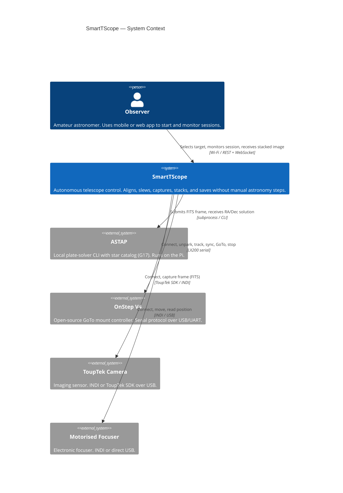
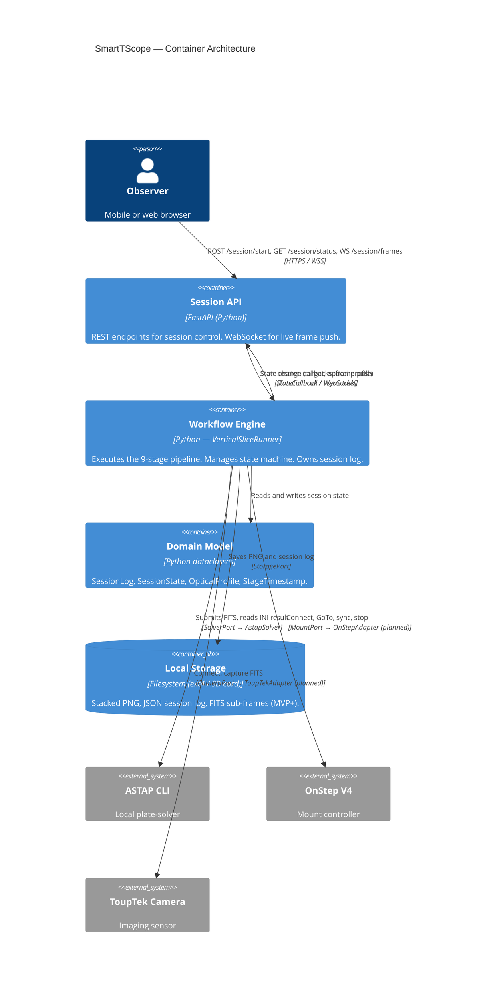
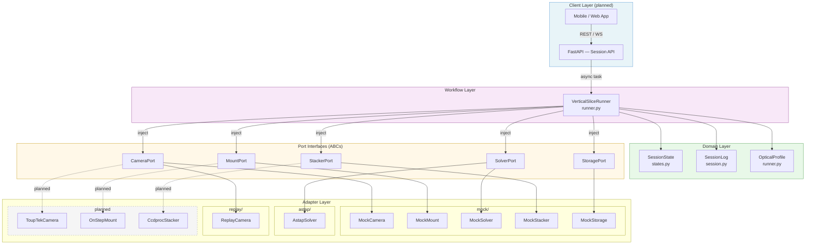
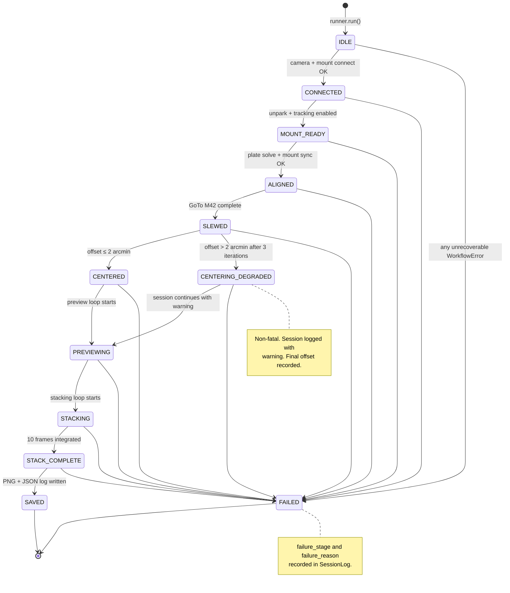
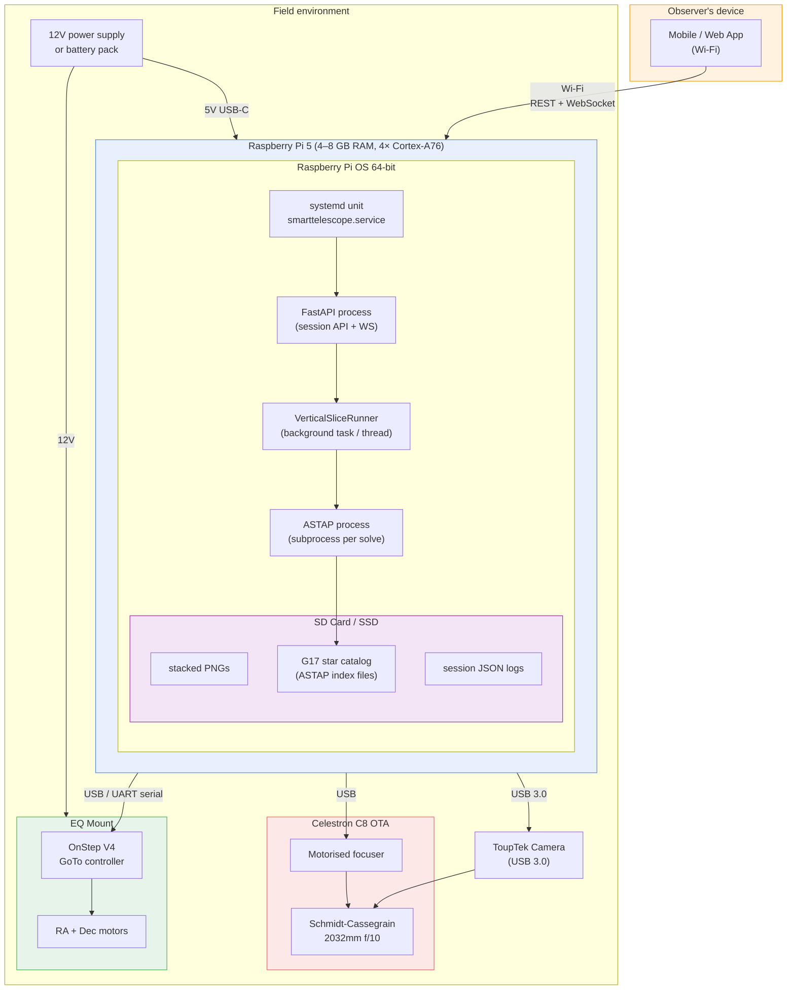
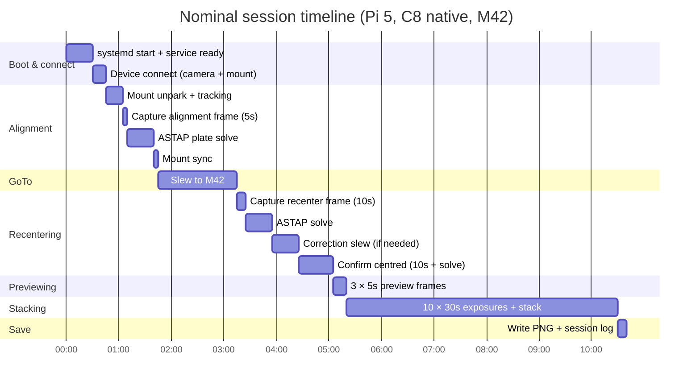

# SmartTScope — Architecture Diagrams

**Last updated**: 2026-04-21

---

## 1. System context (C4 level 1)

Who uses the system and what it touches externally.

---

## 2. Container architecture (C4 level 2)

The internal runtime components and how they communicate.

---

## 3. Module / hexagonal architecture

The internal code structure showing the Ports & Adapters pattern.

---

## 4. Session state machine

Complete state machine including degraded and failure paths.

---

## 5. Deployment on Raspberry Pi 5

Physical and logical deployment of all components.

---

## 6. Pipeline timing budget (nominal session on Pi 5)

End-to-end time estimate under nominal field conditions. All values are estimates pending real hardware measurement.

**Total nominal session time: ~10–11 minutes** from power-on to saved stack. Plate solving dominates uncertainty; ASTAP on Pi 5 can range from 15 s to 90 s depending on star density and cold-start catalog loading.

---

## Related documents

- [`architecture-review.md`](architecture-review.md) — full critical review with issues and risk register
- [`../wiki/vertical-slice-mvp.md`](../wiki/vertical-slice-mvp.md) — stage-by-stage specification
- [`../wiki/requirements.md`](../wiki/requirements.md) — full requirement set
- [`../wiki/hardware-platform.md`](../wiki/hardware-platform.md) — hardware context
