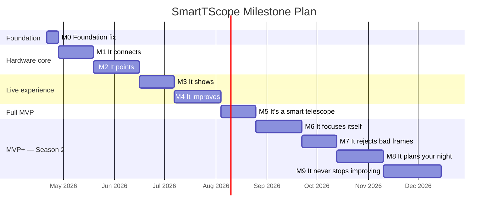

# SmartTScope — Milestone Plan

**Version**: 1.0
**Date**: 2026-04-21
**Team roles represented**: Project Owner · Architect · Lead Developer · Requirements Engineer · Tester

---

## Purpose and guiding principles

This plan answers the sponsor's concern directly: the project needs to produce experiences customers can feel, not just architecture improvements they cannot see.

Every milestone in this plan is defined by a **customer moment** — a concrete thing a person can do with the system that they could not do before. Quality gates are attached to each milestone so that impressive moments are not undermined by rough edges. Milestones are sequenced so that each one ships on real hardware, not mocks.

### Principles

1. **Real hardware every milestone.** From M1 onward, every milestone runs on the actual Pi 5 + C8 + OnStep + ToupTek stack. Mock-only progress does not count toward a milestone.
2. **Customer moment first.** Each milestone is named for what a user experiences. Internal infrastructure work is a means, never a milestone.
3. **Quality gates are non-negotiable.** A milestone is not closed until its quality gate passes. Shipping broken experiences damages trust more than shipping late.
4. **Foundation before features.** M0 is a one-week internal sprint. It is not visible to customers but it makes everything after it possible. It ships immediately.
5. **Fail fast at integration.** Hardware integration begins in M1, not M3. Problems found early cost weeks; problems found late cost months.

---

## Timeline overview

| Milestone | Name | Target date | Customer moment |
|---|---|---|---|
| M0 | Foundation fix | 2026-04-28 | Internal — enables everything |
| M1 | It connects | 2026-05-19 | Hardware shakes hands |
| M2 | It points | 2026-06-16 | Telescope centers a target autonomously |
| M3 | It shows | 2026-07-07 | Live sky on your phone |
| M4 | It improves | 2026-08-04 | Watch the image get better |
| M5 | It's a smart telescope | 2026-08-25 | Full unattended session, zero manual steps |
| M6 | It focuses itself | 2026-09-22 | Sharp stars without touching anything |
| M7 | It rejects bad frames | 2026-10-13 | Clouds pass; the stack keeps getting better |
| M8 | It plans your night | 2026-11-10 | Set targets, go to bed, wake up to results |
| M9 | It never stops improving | 2026-12-15 | Multi-night, mosaic, planetary mode |

**MVP delivery: 2026-08-25 (M5)**
**MVP+ competitive parity: 2026-12-15 (M9)**

---

## M0 — Foundation fix

**Duration**: 1 week · **Target**: 2026-04-28
**Customer moment**: None — internal sprint. Enables all subsequent milestones.

This sprint closes the gaps identified in the retrospective that block all further development. It produces no visible customer value but without it, real hardware work cannot begin cleanly.

### Deliverables

| # | Task | Owner | Rationale |
|---|---|---|---|
| F1 | Standardise on Python 3.11; fix dev environment and pyproject.toml | Dev | Version mismatch found in retro |
| F2 | Add GitHub Actions CI workflow running pytest on Python 3.11 | Dev | No CI = no quality signal |
| F3 | Add structured Python logging to all stage transitions and WorkflowError | Dev | Undebuggable without logs |
| F4 | Add `FocuserPort` ABC to ports/; add `MockFocuser`; wire into runner | Dev + Arch | Required by MVP spec Stage 1 |
| F5 | Add `stop()` to `MountPort`; add cancellation `threading.Event` to runner | Dev + Arch | Emergency stop is MVP safety requirement |
| F6 | Fix `ReplayCamera` to read FITS header for actual width/height | Dev | Silent lie in Frame type |
| F7 | Add `storage.estimate_required_bytes(frame_count, frame_size)` to port | Dev | Replaces binary `has_free_space()` |
| F8 | Fill missing test coverage: slew timeout, unpark failure, recenter failure, stacker failure | Tester | 4 untested code paths found in retro |
| F9 | Add `_angular_offset_arcmin` unit test | Tester | Core astronomy logic, zero coverage |
| F10 | Move mock-based tests to `tests/unit/`; keep hybrid tests in `tests/integration/` | Tester | Mislabelled directory |

### Quality gate M0

- [ ] `pytest tests/` passes on Python 3.11 with zero warnings
- [ ] CI green on first push
- [ ] All 8 retrospective test gaps covered
- [ ] `FocuserPort` present in ports/, mocked, wired

---

## M1 — "It connects"

**Duration**: 3 weeks · **Target**: 2026-05-19
**Customer moment**: A user powers on the system, opens the app, and sees three green checkmarks — Camera ✓  Mount ✓  Focuser ✓ — within 30 seconds. If anything fails, the app names the device and offers a retry.

This is the first milestone where real hardware is involved. It forces the async/threading decision, the API design, and the Linux ASTAP installation — all at once, before they accumulate into a larger problem.

### Deliverables

| # | Task | Owner | Rationale |
|---|---|---|---|
| M1.1 | Install Pi OS on Pi 5; confirm ASTAP + G17 catalog installs cleanly; document Linux path | Dev + Ops | ASTAP Windows path is broken on Pi |
| M1.2 | Define async model: FastAPI + `asyncio.to_thread` for blocking pipeline | Arch | Blocks API and camera SDK integration |
| M1.3 | Implement `OnStepMount` adapter — connect, get_state, unpark, enable_tracking, stop, disconnect | Dev | LX200 serial over USB |
| M1.4 | Implement `ToupTekCamera` adapter — connect, capture (FITS), disconnect | Dev | ToupTek SDK USB integration |
| M1.5 | Implement `FocuserIndi` or `FocuserUsb` adapter — connect, disconnect | Dev | Minimum: connect/disconnect only |
| M1.6 | FastAPI endpoint: `POST /session/connect` → returns `{camera, mount, focuser}` status | Dev | First API surface |
| M1.7 | FastAPI endpoint: `GET /session/status` → current state + device health | Dev | Client polling during startup |
| M1.8 | Introduce `FitsFrame` typed domain object (replaces `Frame.data: bytes`) | Dev + Arch | Retro critical issue C2 |
| M1.9 | Minimal web UI: connect button, device status panel, session state badge | Dev | Customer must be able to feel the milestone |
| M1.10 | Integration test: full connect stage on real hardware (manual pass/fail record) | Tester | First real hardware test |
| M1.11 | Add ASTAP validate() call at startup — fail fast if catalog missing | Dev | Retro critical issue C3 |

### Quality gate M1

- [ ] Connect stage completes within 30 seconds on real hardware under nominal conditions
- [ ] If any device fails, the API response names the device — not a generic error
- [ ] App shows three green/red indicators matching actual hardware state
- [ ] `POST /session/connect` returns structured JSON (not a 500)
- [ ] Disconnect called safely after any connect failure (no dangling serial connections)
- [ ] All unit and integration tests pass on Python 3.11

### Acceptance criteria (requirements §2 partial)

- AC-M1-1: Camera, mount, and focuser connect within 30 s under nominal conditions
- AC-M1-2: Per-device failure surfaces the device name and a retry action
- AC-M1-3: Session state transitions to CONNECTED only when all three devices report OK
- AC-M1-4: ASTAP and G17 catalog presence validated at service start; missing catalog surfaces a named error before any session starts

---

## M2 — "It points"

**Duration**: 4 weeks · **Target**: 2026-06-16
**Customer moment**: A user taps "Go to M42" in the app. The mount unparks, the telescope plate-solves the sky, slews to M42, and centers it within 2 arcminutes — all without the user touching the telescope. The app shows real-time stage progress throughout.

This is the core autonomous pointing experience. When this milestone passes, the system has earned the right to be called a telescope controller rather than a demo.

### Deliverables

| # | Task | Owner | Rationale |
|---|---|---|---|
| M2.1 | Linux ASTAP path handling + `validate()` integrated and tested on Pi | Dev | ASTAP must run on Pi OS |
| M2.2 | Full pipeline on real hardware: connect → align → goto → recenter | Dev | Replaces mock-driven pipeline |
| M2.3 | OnStep adapter: complete all MountPort methods including `goto`, `sync`, `is_slewing`, `stop` | Dev | Complete motor interface |
| M2.4 | Replace `time.sleep` poll with event-based slew monitoring | Dev + Arch | Responsiveness + emergency stop |
| M2.5 | FastAPI endpoint: `POST /session/start` — accepts target name, optical profile | Dev | Target is no longer hardcoded |
| M2.6 | FastAPI endpoint: `POST /session/stop` — triggers cancellation Event, calls mount.stop() | Dev | Emergency stop via API |
| M2.7 | Minimal target catalog: M42, M31, M45, M57, and 20 Messier objects as JSON | Req Eng + Dev | Remove hardcoded M42 |
| M2.8 | Solar safety gate: Sun target requires explicit confirmation; no silent slew | Dev | MVP safety requirement — cannot defer |
| M2.9 | App UI: target picker, stage progress indicator, emergency stop button | Dev | Customer must feel the experience |
| M2.10 | Assign concrete values to all §12 performance targets | Req Eng | All TBD values resolved |
| M2.11 | Hardware integration test: align → center M42, measure actual offset | Tester | Verify AC-M2-3 on real sky |
| M2.12 | Optical profile selection in API (C8 native, reducer, Barlow) | Dev | Runtime profile switch |

### Quality gate M2

- [ ] Plate solve succeeds on first attempt ≥ 80% of clear-sky sessions
- [ ] M42 centered within 2 arcmin RMS in ≤ 3 correction iterations on real hardware
- [ ] Emergency stop halts all mount motion within 2 seconds of button press
- [ ] Solar safety gate blocks Sun slew without confirmed dialog
- [ ] Slew completes within 120 seconds with real OnStep hardware
- [ ] All §12 performance target values populated (no TBD remaining)

### Acceptance criteria

- AC-M2-1: `POST /session/start` accepts `{target: "M42", profile: "C8-native"}`; session cannot start with target="Sun" without solar_filter_confirmed=true
- AC-M2-2: Stage progress (IDLE → CONNECTED → … → CENTERED) visible in app in real time
- AC-M2-3: On-sky centering offset ≤ 2 arcmin RMS, verified on minimum 3 separate sessions
- AC-M2-4: `POST /session/stop` returns 200 and mount reaches stopped state within 2 s
- AC-M2-5: If plate solve fails twice, session halts with error naming suggested fix ("check polar alignment", "sky obstructed?")

---

## M3 — "It shows"

**Duration**: 3 weeks · **Target**: 2026-07-07
**Customer moment**: After the telescope centers the target, a live image of the sky appears on the user's phone. It updates every 5–10 seconds. The image is stretched — faint nebulosity is visible, not a black frame. This is the first moment the user sees something beautiful.

### Deliverables

| # | Task | Owner | Rationale |
|---|---|---|---|
| M3.1 | Auto-stretch pipeline: FITS → numpy → asinh stretch → 8-bit → JPEG | Dev | Core image display requirement |
| M3.2 | WebSocket endpoint: `WS /session/frames` — pushes JPEG per preview capture | Dev | Live transport |
| M3.3 | Real preview loop: 5 s captures, stretch, push to all connected clients | Dev | Replaces preview stub |
| M3.4 | App UI: live image viewer with brightness/contrast sliders | Dev | Customer experience |
| M3.5 | Histogram overlay in app (stretch feedback) | Dev | Users need to know image quality |
| M3.6 | Wi-Fi hotspot provisioning: Pi broadcasts its own SSID; app auto-discovers | Dev | First-time setup flow (requirements §2) |
| M3.7 | App reconnect: session survives phone screen-off and reconnect without state loss | Dev | Session persistence (requirements §8 promoted-to-MVP) |
| M3.8 | Performance test: preview frame visible in app within 15 s of PREVIEWING state | Tester | AC-M3-1 |
| M3.9 | Test: WebSocket push continues during concurrent plate solve (thread safety) | Tester | Concurrency regression |

### Quality gate M3

- [ ] First preview frame visible in app within 15 seconds of PREVIEWING state on real hardware
- [ ] Subsequent frames arrive within 10 seconds on nominal Wi-Fi
- [ ] Stretch is applied — image is not a raw dark blob at default settings
- [ ] App reconnects after 60-second network gap without session loss
- [ ] Pi 5 CPU temperature remains below defined ceiling during concurrent preview + future solve

### Acceptance criteria

- AC-M3-1: First JPEG frame received by app ≤ 15 s after PREVIEWING state
- AC-M3-2: Frame rate ≥ 1 frame per 10 s under load (concurrent API calls + WebSocket push)
- AC-M3-3: Reconnecting app receives current state and next frame without user action
- AC-M3-4: Device pairs via SSID discovery within 60 s on first use

---

## M4 — "It improves"

**Duration**: 4 weeks · **Target**: 2026-08-04
**Customer moment**: The user watches their phone as the image visibly improves with each frame. After 10 minutes the Orion Nebula fills the screen with detail invisible in a single shot. The system did it automatically. This is the defining smart-telescope moment.

### Deliverables

| # | Task | Owner | Rationale |
|---|---|---|---|
| M4.1 | Real stacker: numpy float32 running mean over registered frames | Dev | Replaces MockStacker |
| M4.2 | Frame registration: astroalign or WCS-based shift correction | Dev | Frames must align before stacking |
| M4.3 | Switch stacking to 30 s exposures; push stretched stack after each frame | Dev | Live improvement experience |
| M4.4 | Save final stack as PNG + FITS on session complete | Dev | MVP output requirement |
| M4.5 | JSON session log: all fields from spec (target, times, frames, offsets, warnings) | Dev | Requirements §8 |
| M4.6 | Deterministic file naming: `session_<ISO8601>_M42_10x30s.png` | Dev | Requirements §8 |
| M4.7 | Storage estimate before session start: refuse if insufficient space projected | Dev | Retro S6 — replaces binary has_free_space |
| M4.8 | Frame count and integration time visible in app during stacking | Dev | User needs to see progress |
| M4.9 | Stacking memory budget test: 10 × C8 native FITS frames within defined memory limit | Tester | Pi 5 resource constraint |
| M4.10 | Stack SNR improvement test: stack-10 SNR measurably better than single frame | Tester | Core promise of live stacking |
| M4.11 | Power-loss simulation: verify no corrupt PNG on abrupt shutdown during stacking | Tester | Requirements §13 safety |

### Quality gate M4

- [ ] Stack of 10 frames shows measurably better SNR than a single frame (quantified ratio)
- [ ] Client receives updated stack after each 30-second exposure (≤ exposure time + 5 s latency)
- [ ] Final PNG and session JSON written without error under nominal conditions
- [ ] On disk-full: session fails cleanly, no partial PNG, error surfaces to user
- [ ] Memory usage during stacking stays within defined budget on 4 GB Pi 5

### Acceptance criteria

- AC-M4-1: All 10 frames integrate without crash or silent drop
- AC-M4-2: Stack-10 mean SNR ≥ 3× single-frame SNR (theoretical √10 scaling, verified within 20%)
- AC-M4-3: `session_<ISO8601>_M42_10x30s.png` written; JSON log contains all fields specified in vertical-slice-mvp.md §Stage 8
- AC-M4-4: Abrupt power cut during frame 5: session log records interruption; no partial PNG on disk

---

## M5 — "It's a smart telescope"

**Duration**: 3 weeks · **Target**: 2026-08-25
**Customer moment**: A user powers on, opens the app, taps a target, presses Start, and goes inside. 15 minutes later the app notifies them with a saved image. They did not touch the telescope after pressing Start. This is the MVP promise delivered end-to-end.

This milestone closes the MVP. It adds the remaining safety, robustness, and polish items that are required for the system to earn the "smart telescope" label honestly.

### Deliverables

| # | Task | Owner | Rationale |
|---|---|---|---|
| M5.1 | Health dashboard in app: camera, mount, focuser, storage, CPU temp, tracking state | Dev | Requirements §1 |
| M5.2 | Periodic recentering during stacking: solve-and-correct every N frames | Dev | Requirements §7 — promoted to MVP |
| M5.3 | Tracking loss detection: mount stall or loss surfaces to user with named error | Dev | Requirements §7 |
| M5.4 | Manual override: slew nudge via app when GoTo loop fails | Dev | Requirements §10 operational fallback |
| M5.5 | Manual override: set exposure and gain via app when auto-imaging fails | Dev | Requirements §10 |
| M5.6 | Push notification to app on session complete (image preview thumbnail) | Dev | The moment customers tell friends about |
| M5.7 | Full target catalog: Messier + NGC/IC top 200 + planets + Moon | Dev | Requirements §5 |
| M5.8 | Observable-now filtering: hide targets below 20° altitude | Dev | Basic smart filtering |
| M5.9 | systemd unit: auto-start service on Pi boot; auto-recover on crash | Dev | Reliable unattended operation |
| M5.10 | Safe update mechanism: versioned package with rollback capability | Dev | Requirements §13 |
| M5.11 | End-to-end acceptance test: 3 unattended sessions, measure time-to-first-image | Tester | Requirements §12 performance targets |
| M5.12 | Session reliability test: 1-hour unattended session on real hardware | Tester | Requirements §13 |
| M5.13 | Thermal test: CPU temperature log over 90-minute stacking session | Tester | Requirements §12 thermal ceiling |

### Quality gate M5 — MVP acceptance gate

All of the following must pass before M5 is closed. This is the product acceptance gate.

- [ ] 3 consecutive unattended sessions complete IDLE → SAVED without operator intervention
- [ ] Time-to-first-image (power-on to first preview frame) ≤ defined target from §12
- [ ] Centering accuracy ≤ 2 arcmin RMS verified over ≥ 3 independent sessions
- [ ] Plate-solve first-attempt success rate ≥ defined target from §12 over 5 sessions
- [ ] 90-minute session: Pi 5 CPU temperature stays below thermal ceiling
- [ ] Emergency stop halts mount within 2 seconds in all tested conditions
- [ ] Solar safety gate blocks all solar slew attempts without explicit confirmation
- [ ] Session log JSON passes schema validation for all 5 test sessions
- [ ] App reconnects mid-session without data loss after deliberate 60-second network drop

---

## MVP+ milestones — Season 2

These milestones begin after M5 ships. Each one is a distinct customer upgrade experience.

---

## M6 — "It focuses itself"

**Duration**: 4 weeks · **Target**: 2026-09-22
**Customer moment**: Stars snap to a sharp point automatically at session start. The user never touches the focuser knob. On a C8 at f/10, this is the difference between a mediocre image and a stunning one.

### Scope

- Electronic autofocus routine: V-curve or gradient descent on FWHM/HFR metric
- Backlash compensation for the focuser motor
- Refocus trigger on temperature change (>1 °C from last focus), altitude change (>5°), and elapsed time (>30 min)
- Focus quality indicator in app (live HFR value)
- Manual focuser drive via app when autofocus fails (existing M5.4 fallback extended)
- Optical-train awareness: focus tolerance differs between C8 native and reducer

### Quality gate M6

- [ ] Autofocus routine converges to HFR minimum within 10 motor moves under nominal seeing
- [ ] Refocus triggered and completed without user action when temperature drops 2 °C
- [ ] If autofocus fails 3 times, session continues with logged warning and manual override offered

---

## M7 — "It rejects bad frames"

**Duration**: 3 weeks · **Target**: 2026-10-13
**Customer moment**: A cloud passes during a session. The stack does not degrade. The user notices the frame count pauses and a "frame rejected" badge appears. When the cloud clears, stacking resumes. The final image is unaffected.

### Scope

- Frame quality metric: star count, FWHM, background flux
- Automatic rejection of frames below threshold (clouds, vibration, tracking error)
- Rejection reason logged per frame in session JSON
- Dark-frame and bad-pixel correction support
- Reject/accept ratio visible in app during stacking

### Quality gate M7

- [ ] Cloud-affected frames (simulated by introducing out-of-focus frames) rejected automatically
- [ ] Rejection does not halt the session
- [ ] Final stack contains no rejected frame data

---

## M8 — "It plans your night"

**Duration**: 4 weeks · **Target**: 2026-11-10
**Customer moment**: The user creates an observation queue on Sunday evening. Monday at 2 AM the Pi autonomously powers the mount, sequences three targets, stacks each one, and powers down. The user wakes up to three images.

### Scope

- Scheduled observation queue: target, start time, duration, profile
- "Best objects tonight" recommendation sorted by altitude, moon separation, and C8 suitability
- App notification on each target complete
- Context-aware warnings: "M51 too low tonight", "Barlow unsuitable for this target size"
- Session export: easy transfer to phone gallery, NAS, or PC

### Quality gate M8

- [ ] 3-target queue executes unattended; all three sessions reach SAVED
- [ ] Context warning appears when target altitude drops below 20° during session

---

## M9 — "It never stops improving"

**Duration**: 5 weeks · **Target**: 2026-12-15
**Customer moment**: The user aims at the Andromeda Galaxy over three consecutive nights. Each night the stack gets deeper. On the third night the app shows a single combined image representing 90 minutes of total integration. No manual merging required.

### Scope

- Multi-night continuation: resume target, combine subframes across nights
- Mosaic mode: automatic multi-panel capture and stitching for large targets
- Planetary/lunar lucky-imaging mode (separate workflow from DSO stacking)
- Meridian flip with automatic target reacquisition and session continuation
- Cloud interruption recovery: pause session state, retry solve/reacquire when sky clears
- Guiding support groundwork (OAG or guide scope integration)

### Quality gate M9

- [ ] Three-night M31 session produces combined stack with correct total integration time
- [ ] Meridian flip executed and target reacquired without session abort on real hardware
- [ ] Mosaic 2×1 panel of a large target (e.g. California Nebula) stitched correctly

---

## Quality framework — applies to all milestones

### Definition of Done (per milestone)

1. All milestone deliverables are implemented and reviewed
2. All new code has test coverage (unit or integration)
3. CI passes on Python 3.11
4. Quality gate checklist is signed off
5. Acceptance criteria are verified on real hardware (M1 onward)
6. `wiki/log.md` updated with what changed
7. Session demonstrated to project owner before milestone is closed

### Requirement traceability (starting M1)

- Every deliverable references at least one requirement ID from `wiki/requirements.md`
- Every acceptance criterion is linked to the requirement it verifies
- Requirements §12 performance targets updated with measured values after each hardware test

### Test strategy

| Type | When | Tooling |
|---|---|---|
| Unit tests | Every PR | pytest, Python 3.11 |
| Integration tests (mock) | Every PR | pytest |
| Hardware integration tests | Per milestone | Manual pass/fail record + pytest where automatable |
| Performance tests | M2, M4, M5 | timed pytest fixtures, Pi system metrics |
| Thermal tests | M5, M6 | Pi 5 CPU temp log over 90-minute session |
| Acceptance tests | M2, M5 | 3 independent real-sky sessions |

### Review cadence

| Activity | Frequency |
|---|---|
| Code review | Every PR (no self-merge) |
| Sponsor demo | End of each milestone |
| Retrospective | End of M3, M5, M9 |
| Requirements AC review | Before M2, M5 |

---

## Risk register (milestone impact)

| Risk | Affects | Mitigation |
|---|---|---|
| ToupTek SDK Python bindings not available for Pi OS / ARM64 | M1 | Evaluate INDI as fallback before M1 starts; allocate 1 week buffer |
| ASTAP solve time on Pi 5 exceeds 60 s on cold start | M2 | Profile on hardware early in M1; tune `-maxstars`; evaluate astrometry.net local as backup |
| Frame registration (astroalign) fails on C8 narrow FOV star fields | M4 | Prototype during M3; WCS-based registration as fallback |
| Pi 5 thermal throttling during concurrent solve + stack | M4, M5 | Thermal test in M4; add heatsink/fan if needed; serialize solve and stack if required |
| OnStep LX200 serial protocol edge cases on real mount | M2 | Dedicate first 3 days of M2 to protocol conformance testing before pipeline integration |
| Weather dependency for hardware testing (clear skies needed) | M2, M3, M5 | Schedule hardware test windows flexibly; use daytime solar (with safety gate) for pointing tests |

---

## What the sponsor should see at each milestone demo

| Milestone | Demo script |
|---|---|
| M0 | CI badge green; show test count before/after; show FocuserPort in code |
| M1 | Open app → connect → three green checkmarks in < 30 s on real hardware |
| M2 | Select M42 → Start → watch stage progress → telescope physically moves → "Centered" appears |
| M3 | Continue from M2 → live sky image appears on phone in < 15 s |
| M4 | Watch 10 frames stack live; compare frame 1 vs frame 10 side by side |
| M5 | Walk away after Start; return 15 min later; saved image notification; zero interventions |
| M6 | Defocus telescope manually → tap Autofocus → stars sharpen automatically |
| M7 | Hold hand in front of scope for 30 s; stack unaffected; rejection badge appears |
| M8 | Queue 3 targets for 10 PM; come back at midnight; three images saved |
| M9 | Show M31 combined from two nights; measurably more detail than either night alone |
